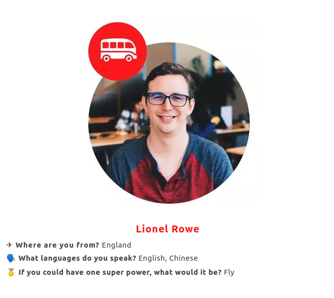

# BlogExchange

_Working title!_
<!-- 5s -->

---

## 3 completely fictional personas
<!-- 10s -->

+++

## Completely fictional persona #1

<!-- 15s -->

+++

## Completely fictional persona #2

<!-- 15s -->

+++

## Completely fictional persona #3

<!-- 15s -->

---

## Pain points of language learning and cultural exchange

- Difficult to get _qualitative_, _unstructured_ feedback
- Cultural knowledge and understanding is in silos
- Excellent teachers and motivated learners never get the opportunity to learn from each other
<!-- 25s -->

---

## Solution - BlogExchange

- Write (long-ish form) blog posts in target language
- Receive annotations (comments)
- Make inline changes (corrections)
<!-- 35s -->

---

## Thanks!

- Questions?
<!-- 5s -->

